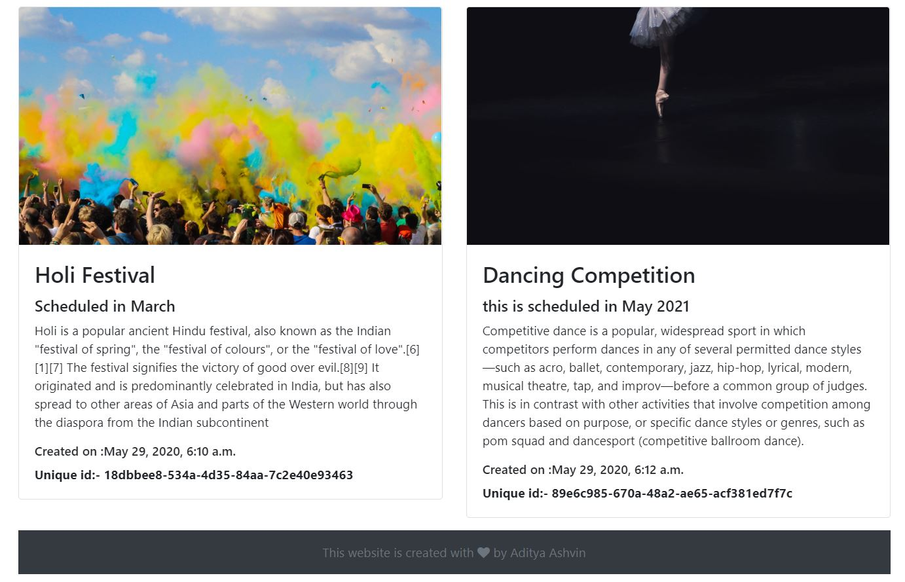
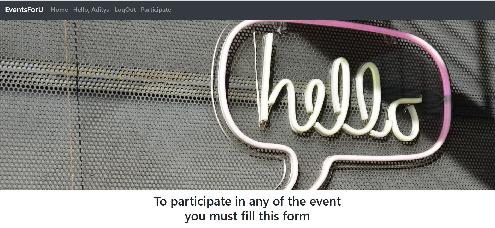
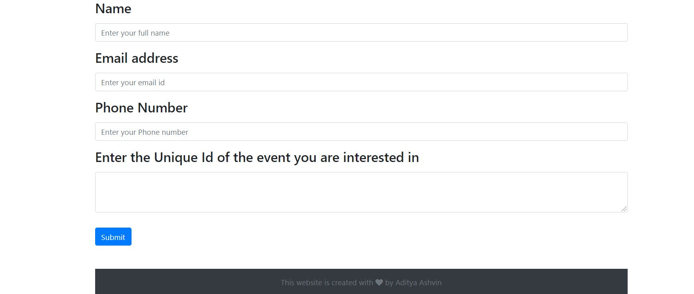
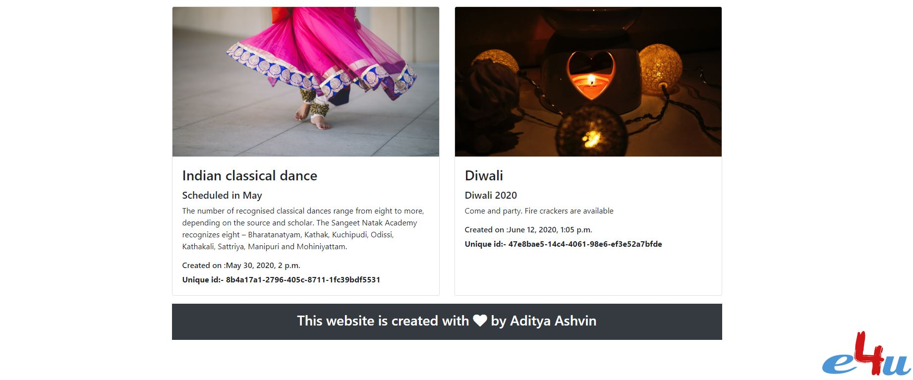
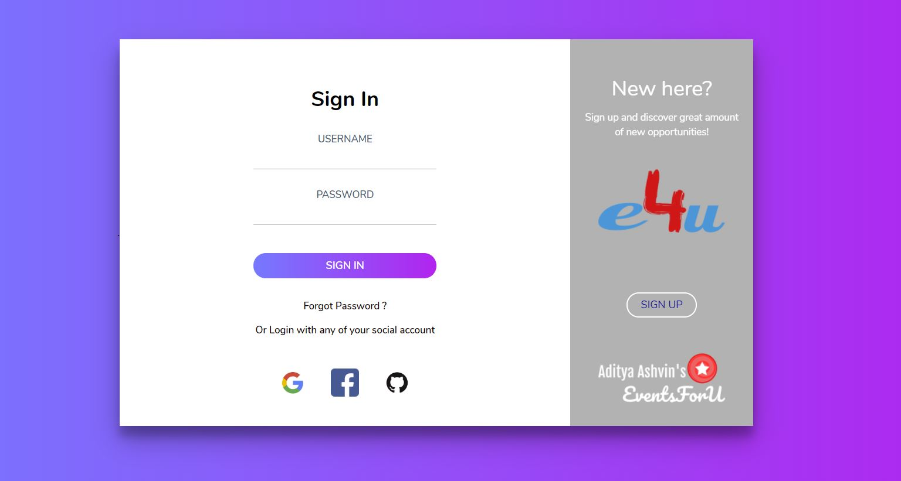
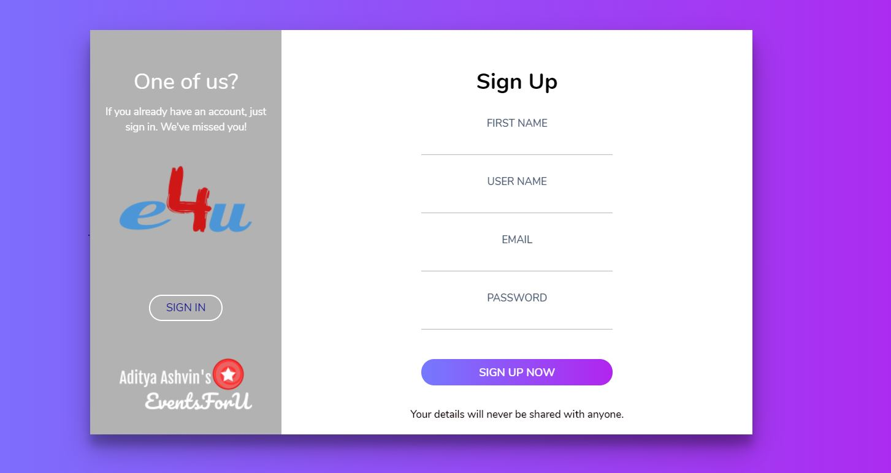
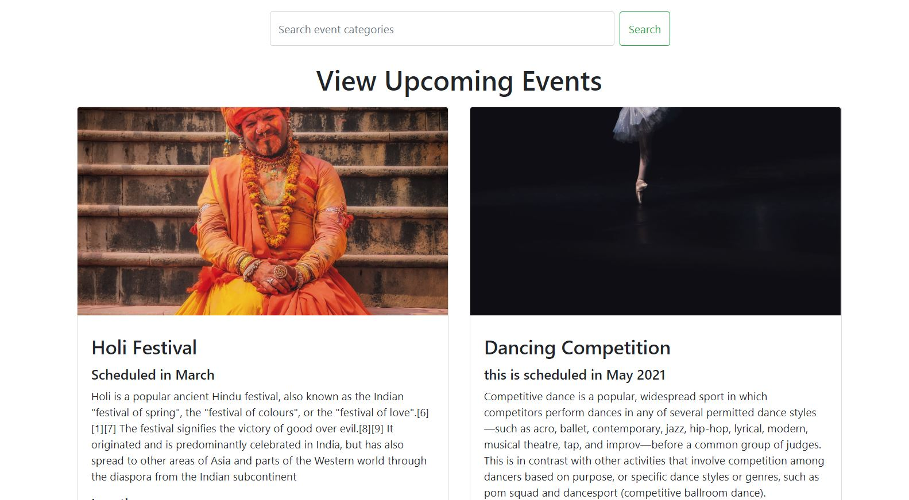
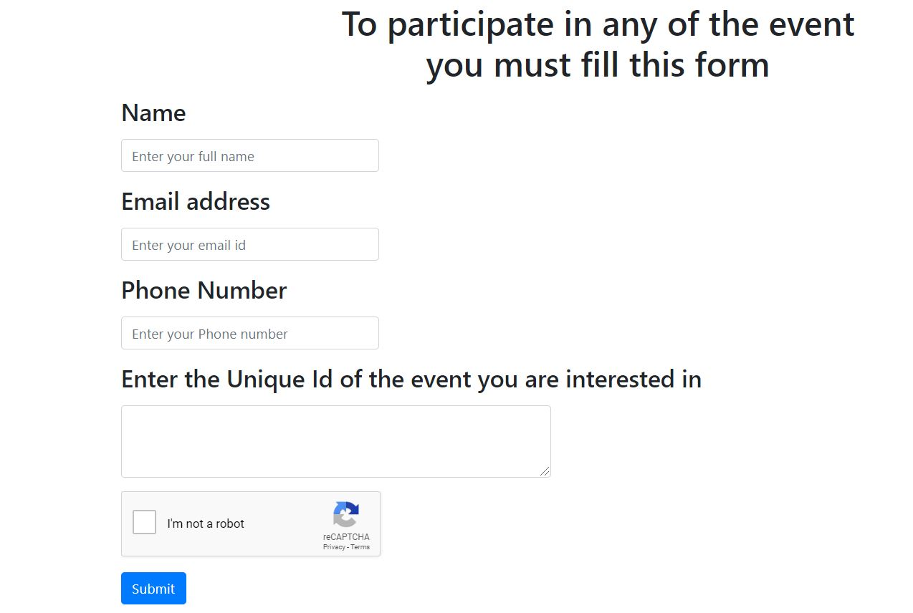
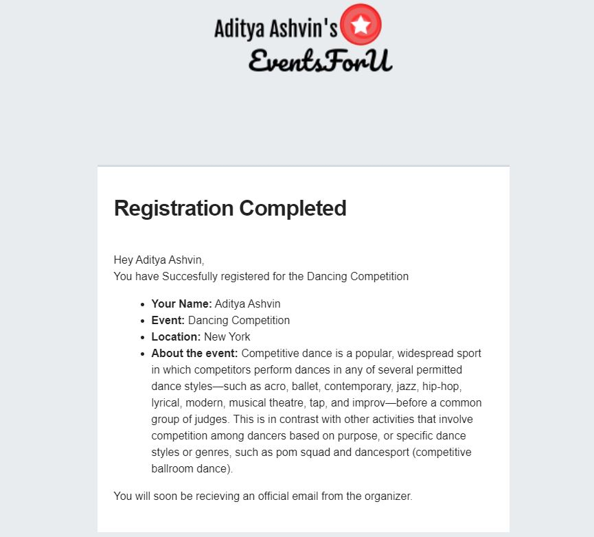

### An Event Registration Website made using the Django Framework

### Deployed on Heroku

# Features of the website
**v0.0**
> 1. The admin can dynamically add the events. The date, time, image(based on the title given) and the unique id will be generated on its own. the admin has to give a title, header, basic description, location, organizer details and tags related to the event.
>
> 2. The participant can view the upcoming events and then fill the form in the Particpants page to register for a particular event
>
> 3. The participant can only fill the Participants form when he/she is logged in.
>
**What's new in v0.1**
> 1. User can now login with their Google or GitHub accounts.
>
> 2. A new logo added in the Navbar
>
> 3. Font size of text in navbar and footer increased for better viewing
>
**What's new in v0.3**
>1. Added reCAPTCHA in the participant form.
>
>2. Sending an email as soon as the form is filled.
>
>3. Improvements in the UI of the HomePage.
>
>4. Search bar added in the HomePage.
>
>5. Tags, Location, Organizer details added for each event.
>
**Future plans**
> Integrate payment option using Stripe or PayTM
>
> Add ML
>
> Better profile page for the users
# Installation
### 1. Install python
> https://realpython.com/installing-python/
### 2. Clone this repo into your local machine 
> git clone https://github.com/AdityaAshvin/EventsForU.git
### 3. Install django
> pip install django
### 4. Final Step
> go to the directory where manage.py is located and run the following command
>
>> python manage.py runserver
# Screenshots
### v0.0
### HomePage when the User is logged in

### HomePage when the User is not logged in

### Participant Page when the user is logged in

### ParticipantPage when the User is not logged in

### v0.1
### HomePage when the User is logged in

### Login Page

### SignUp Page

### v0.3
### Tags, Location added

### Search Bar

### reCAPTCHA

### Registration Completed email

### This UI of the website is built with the help of
> [Bootstrap](https://getbootstrap.com/)
>
> [FontAwesome](http://fontawesome.io/)
>
> [Unsplash API](https://unsplash.com/developers)
### Logo made using
> [LogoMaker](https://www.freelogodesign.org/)
